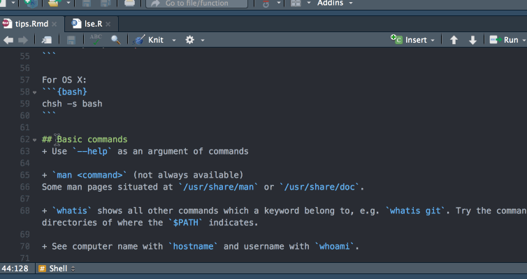

# caseconverter

An RStudio Addin to convert text cases to lower, upper, snake, and camel cases.



## Installation

```
devtools::install_github("strboul/caseconverter")
```

## Reasoning
I often find myself to change the cases in the code that can be either a function name or a comment.
